# CatCat聊天客户端
ChatCat聊天(客户端)，Swing+Socket(TCP)+MySQL，JavaSE课程项目。

## 服务端项目地址
[ChatCat_Server](https://github.com/LauZyHou/ChatCat_Server)

## 客户端运行展示
### 注册
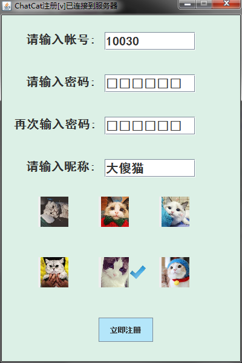
### 登录
新注册的用户没有好友，为了演示方便，这里用另一个账户。

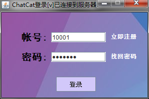
### 联系人
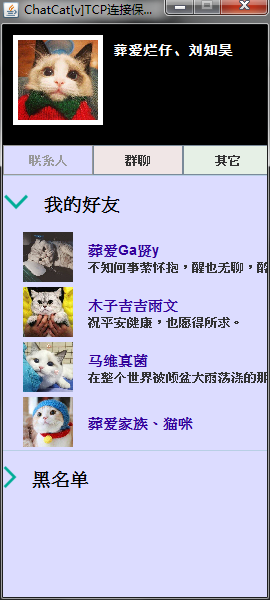
### 功能栏
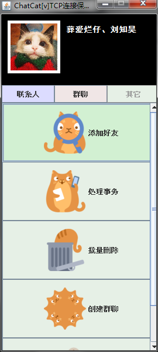
### 聊天
可以给离线用户发消息。用户不在线时，消息被缓存在内存中，待用户上线时会弹出。

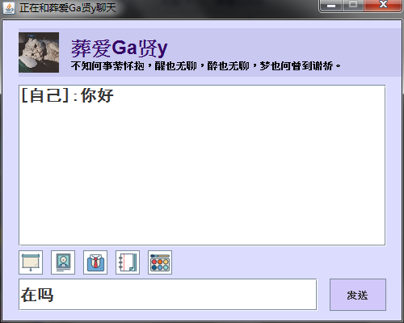
### 查看好友资料
在此处可以删除该好友。

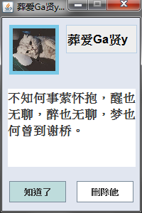
### 查找用户&添加好友
可以根据账号精确查找，也可以根据用户昵称模糊查询。

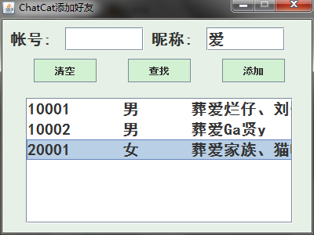
### 批量删除好友
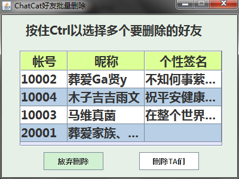

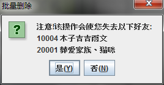
### 查看个人信息
点击自己的头像即可打开个人信息面板。

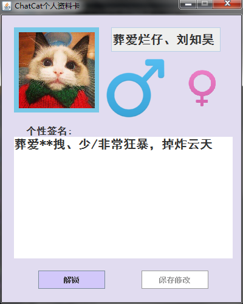
### 修改个人信息
点击下方的解锁按钮后，才可以对自己的信息进行编辑。这里蓝色和红色的标志即表示性别，点击即可修改性别。

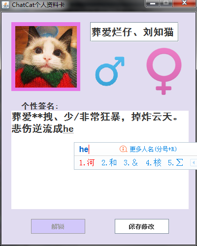

点击保存修改。

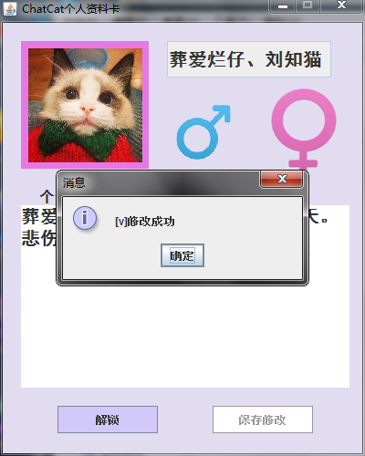
### 错误反馈
此处做了长度检查，错误反馈的信息字数太少会有提示。

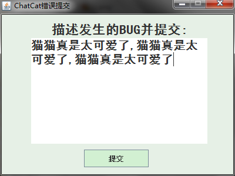

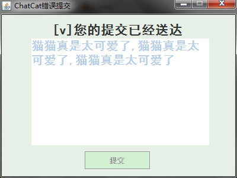

## 配置本项目
### 数据库服务器配置
可以在本机配置MySQL数据库，也可以在本机局域网内的一台电脑上配置MySQL数据库。

先在MySQL中建立名为ChatCatDB的scheme，然后将[ChatCat_Client/mysql\_bash/ChatCatDB.sql]运行导入该数据库即可。

### 配置客户端连接服务端
在主类[ChatCat_Client/src/Login/Main]中第5行配置服务端的ip地址，客户端只要和服务端在同一个局域网内都可以。

## 运行本项目
直接从主类[ChatCat_Client/src/Login/Main]运行。

为调试方便，在该文件10~11行直接将数据库中的一条登录信息写入了登录框，可以将其注释掉。

## 附注
ChatCat的客户端、数据库、服务端允许分离在不同的主机上，可以使用一台路由器建立局域网，在局域网内实现多线程聊天。